[](LICENSE)
[](https://github.com/apiksdev/axel-marketplace)
[](https://github.com/apiksdev/axel-core/blob/master/FUNDING.md)

# AXEL Todos Plugin

AXEL Todo management plugin for task creation, tracking, and execution.

## Features

- **Todo Management**: Create, list, and execute todos
- **Workspace Support**: Organize todos in workspaces
- **Backlog Management**: Store and convert feature ideas to todos
- **Priority System**: Prioritize tasks with high/medium/low levels
- **Status Tracking**: Track todo status (pending, in-progress, completed)

## Installation

```bash
# Add marketplace (if not added)
claude plugin marketplace add apiksdev/axel-marketplace

# Install axel-todos plugin
claude plugin install axel-todos@axel-marketplace
```

See: [axel-marketplace](https://github.com/apiksdev/axel-marketplace)

## Usage

```mermaid
flowchart TB
    I[💡 Idea] --> B[Backlog]
    I -->|ready| T[📝 Todo]
    B -.->|convert| T
    T --> R{▶️ Run}
    F[📄 File Path] -->|direct| R
    R -->|sequential| S[🤖 → 🤖 → 🤖]
    R -->|parallel| P[🤖 ∥ 🤖 ∥ 🤖]
    S --> D[✅ Done]
    P --> D
```



### Workspace Management

> Workspaces group related todos into focused containers. Each workspace represents a project, feature, or sprint. Use `overview` to get AI-generated statistics and progress reports across all workspaces or drill down into a specific one.

```bash
/axel:workspace {name}           # Create new workspace
/axel:workspace create {name}    # Create new workspace (explicit)
/axel:workspace overview         # Overview of all workspaces
/axel:workspace overview {name}  # Overview of specific workspace
```

**Examples:**
```bash
/axel:workspace auth-refactor
/axel:workspace create payment-integration
/axel:workspace overview
/axel:workspace overview auth-refactor
```

### Todo Management

> Unlike traditional todos, AXEL todos are **AI-executable**. Each todo contains structured instructions that AI can understand and run autonomously. Create a todo with a topic, and AXEL generates implementation steps. Run it, and AI executes those steps for you.
>
> **Execution modes:** Run todos sequentially for dependent tasks, or in parallel for independent work. AI handles the orchestration automatically.

```bash
/axel:todos {topic}              # Create new todo
/axel:todos create {topic}       # Create new todo
/axel:todos list                 # List all todos
/axel:todos run                  # Run todos (workspace selection)
/axel:todos run {path}           # Run specific todo directly
```

**Examples:**
```bash
/axel:todos Add user authentication with JWT
/axel:todos create Fix memory leak in cache service
/axel:todos list
/axel:todos run
/axel:todos run .claude/workspaces/auth/todos/001-setup-jwt.md
```

### Backlog Management

> Backlogs capture ideas that aren't ready for execution yet. While todos are structured and immediately actionable, backlogs are raw feature ideas or future plans. When you're ready to work on an idea, `convert` transforms it into a proper AXEL todo with AI-generated implementation steps.

```bash
/axel:backlogs                   # List backlogs
/axel:backlogs create {desc}     # Create a new backlog item
/axel:backlogs convert           # Convert backlog to todo
```

**Examples:**
```bash
/axel:backlogs
/axel:backlogs create Add dark mode support with theme switching
/axel:backlogs create Implement real-time notifications using WebSocket
/axel:backlogs convert
```

## Todo Status Flow

| Status        | Description                         |
| ------------- | ----------------------------------- |
| `pending`     | Todo created, waiting to be started |
| `in-progress` | Todo currently being executed       |
| `completed`   | Todo finished successfully          |

## File Structure

```
axel-todos/
├── CLAUDE.md                 # Project configuration
├── plugin.json               # Plugin metadata
├── commands/
│   ├── axel-todos.md         # Todo command
│   ├── axel-workspace.md     # Workspace command
│   └── axel-backlogs.md      # Backlog command
├── agents/
│   └── agent-axel-todo-runner/
│       └── AGENT.md          # Todo runner agent
└── skills/
    └── skill-axel-todos/
        ├── SKILL.md          # Skill definition
        ├── scripts/
        │   └── axel_todo.py  # Todo management script
        ├── workflows/
        │   ├── AXEL-Todo-Create-Workflow.md
        │   ├── AXEL-Todo-List-Workflow.md
        │   ├── AXEL-Todo-Run-Workflow.md
        │   ├── AXEL-Workspace-Create-Workflow.md
        │   └── AXEL-Backlog-Workflow.md
        ├── references/
        │   └── AXEL-Todo.md
        └── templates/
            └── todos/
                └── AXEL-Todo-Tpl.md
```

## License

Apache-2.0
